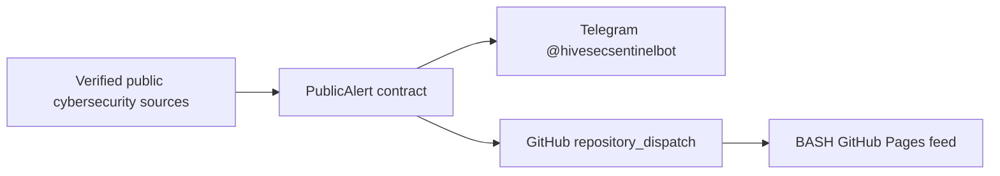

# HiveSec Sentinel architecture



## Boundary

- Sentinel is the only public-alert publisher.
- Butler is a private assistant and never supplies personal context or credentials here.
- Data Breach Scanner events, victim identities and private outboxes are rejected.
- The BASH site accepts only alerts with `source=HiveSec Sentinel`.

## Public contract

```json
{
  "schema_version": 1,
  "id": "hivesec-<stable digest>",
  "title": "HiveSec Sentinel — incident title",
  "message": "Bounded public alert text",
  "severity": "critical",
  "source": "HiveSec Sentinel",
  "published_at": "2026-07-23T10:00:00+00:00"
}
```
