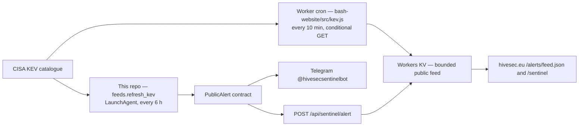

# HiveSec Sentinel architecture

Last reviewed: 13 September 2026.

## Two collectors, one contract

Since 10 September 2026 the public feed has **two** producers. They are
deliberately equivalent: `src/kev.js` in the `bash-website` repository is a port
of `feeds.py:kev_alerts()` here, producing the same ids (`hivesec-kev-<cve>`),
titles and wording, so whichever runs first wins and the other dedupes.



**The Worker cron is the primary collector.** It runs in Cloudflare, so the feed
no longer freezes when this machine sleeps — which is what the 6-hourly
LaunchAgent did. This repository remains the only publisher to **Telegram**, and
the only path for an alert that does not come from KEV.

## Current state — the intake is blocked

Cloudflare Access fronts every path of all six BashHive hostnames (13 Sep 2026).
`POST /api/sentinel/alert` answers **302** to the login page: the edge does not
know what `X-HiveSec-Token` is. Verified with the live Keychain token.

Consequences, until an Access **Service Auth** application exists for that path:

- `refresh-kev` cannot deliver to the site. Telegram still works.
- Since 2026-09-13, an alert accepted by Telegram is recorded as seen even
  though the site channel rejected it (`--record-on`, default `telegram`), so
  the public bot does not repeat itself every six hours. Before that change
  nothing was marked seen and the whole batch was re-sent on every run — that
  was described as at-least-once delivery, but against a permanently failing
  channel it was an unbounded repeat.
- The consequence is deliberate: while the intake is blocked, alerts recorded
  this way are **not** delivered to the site and will not be retried there. The
  site feed is not affected, because the Worker cron collects the same entries
  independently. If the site channel is ever the exclusive one again, run with
  `--record-on all`.
- The KV feed stays current anyway, from the Worker cron.

See `bash-website/CUTOVER_ACCESS_LOGIN_20260909.md` §T.

## Boundary

- Sentinel is the only public-alert publisher.
- Butler is a private assistant and never supplies personal context or
  credentials here.
- Data Breach Scanner events, victim identities and private outboxes are
  rejected.
- The site accepts only alerts with `source=HiveSec Sentinel`.

## Public contract

```json
{
  "schema_version": 1,
  "id": "hivesec-<stable digest>",
  "title": "HiveSec Sentinel — incident title",
  "message": "Bounded public alert text",
  "severity": "critical",
  "source": "HiveSec Sentinel",
  "published_at": "2026-07-23T10:00:00+00:00"
}
```

Changing this contract means changing four places together: `publisher.py` here,
`src/alerts.js` and `src/kev.js` in `bash-website`, and both test suites.
