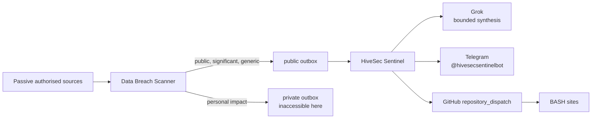

# HiveSec Sentinel architecture



## Security boundary

- Only versioned JSON events marked `classification=public` are accepted.
- Filenames and IDs must match `breach-<24 hex>`, files must be regular and at most 64 KiB.
- Any event containing a `victim` field is rejected before Grok or delivery.
- Grok receives the already-public event inside explicit untrusted-content delimiters.
- Telegram and GitHub must both succeed before the event moves to `processed/public`.
- Per-event delivery state prevents a successful channel being repeated after the other fails.
- Grok failure uses a deterministic summary; delivery failure leaves the event pending.

## Public contract

```json
{
  "schema_version": 1,
  "id": "hivesec-<24 hex characters>",
  "title": "HiveSec Sentinel — incident title",
  "message": "Bounded public alert text",
  "severity": "critical",
  "source": "HiveSec Sentinel",
  "published_at": "2026-06-29T10:00:00+00:00"
}
```

The LaunchAgent polls every five minutes and keeps no resident network listener.
