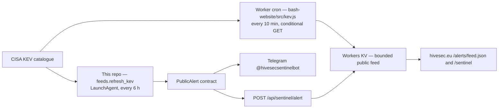

# HiveSec Sentinel architecture

Last reviewed: 13 September 2026.

## Two collectors, one contract

Since 10 September 2026 the public feed has **two** producers. They are
deliberately equivalent: `src/kev.js` in the `bash-website` repository is a port
of `feeds.py:kev_alerts()` here, producing the same ids (`hivesec-kev-<cve>`),
titles and wording, so whichever runs first wins and the other dedupes.



**The Worker cron is the primary collector.** It runs in Cloudflare, so the feed
no longer freezes when this machine sleeps — which is what the 6-hourly
LaunchAgent did. This repository remains the only publisher to **Telegram**, and
the only path for an alert that does not come from KEV.

## Current state — Telegram-only local delivery

Cloudflare Access fronts every path of all six BashHive hostnames (13 Sep 2026).
`POST /api/sentinel/alert` answers **302** to the login page: the edge does not
know what `X-HiveSec-Token` is. Verified with the live Keychain token.

Consequences, until an Access **Service Auth** application exists for that path:

- The scheduled wrapper uses `HIVESEC_SITE_DELIVERY=disabled`, so it sends only
  to Telegram and does not read site-delivery credentials.
- The Worker cron remains the sole routine site collector. Re-enable site
  delivery only after a dedicated Service Auth application is configured for
  the exact intake path; GitHub dispatch is not a fallback.
- The KV feed stays current anyway, from the Worker cron.

See `bash-website/CUTOVER_ACCESS_LOGIN_20260909.md` §T.

## Boundary

- Sentinel is the only public-alert publisher.
- Adelaide reads only `.adelaide/report.json` (contract v1, /Users/raf/Code/adelaide/docs/REPO_REPORTS.md); this repo keeps ownership of its bot.
  It supplies no personal context or credentials here, and the report carries
  only public KEV facts and feed health (see "Adelaide report" below).
- Data Breach Scanner events, victim identities and private outboxes are
  rejected.
- The site accepts only alerts with `source=HiveSec Sentinel`.

## Public contract

```json
{
  "schema_version": 1,
  "id": "hivesec-<stable digest>",
  "title": "HiveSec Sentinel — incident title",
  "message": "Bounded public alert text",
  "severity": "critical",
  "source": "HiveSec Sentinel",
  "published_at": "2026-07-23T10:00:00+00:00"
}
```

## Adelaide report

`hivesec_sentinel.adelaide` writes `<repo>/.adelaide/report.json` after each
non-dry-run `refresh-kev` (also when KEV health fails) and on demand with
`hivesec-sentinel adelaide-report`. It is built from local state only —
`feed_state.json`, the Telegram receipts and `adelaide_cache.json` (bounded:
50 entries, 7 days, 0600) — and never touches the network. One `alert` item per
alert delivered in the last 48 h (`urgent` when the KEV due date is under 7 days
away) plus one `status` item for source health. The KEV `dueDate` is carried
beside the alert, so the `PublicAlert` contract below is unchanged.

Changing this contract means changing four places together: `publisher.py` here,
`src/alerts.js` and `src/kev.js` in `bash-website`, and both test suites.
