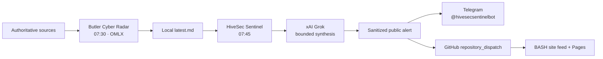

# HiveSec Sentinel architecture

## Responsibility boundary



Butler and HiveSec Sentinel are independent projects and schedules. The only integration
contract is Butler's read-only Markdown report. HiveSec does not import Butler modules, access
its SQLite database, or hold credentials in the Butler Keychain namespace.

## Processing

1. Read at most 512 KiB from Butler's stable `latest.md`.
2. Hash the complete report for idempotency.
3. Extract only the report date and `Must` count deterministically.
4. Send a bounded, explicitly untrusted copy to Grok.
5. Redact common credential shapes and bound the public message.
6. Deliver the same versioned alert to Telegram and GitHub.
7. Record the digest only after both deliveries succeed.

If Grok fails, HiveSec publishes a deterministic count-only summary. Raw report text, local
paths, source excerpts, model prompts and secrets never enter the public alert contract.

## Public contract

```json
{
  "schema_version": 1,
  "id": "hivesec-<24 hex characters>",
  "title": "HiveSec Sentinel — 2026-06-29",
  "message": "Bounded public alert text",
  "severity": "critical",
  "source": "HiveSec Sentinel",
  "published_at": "2026-06-29T10:00:00+00:00"
}
```

The BASH workflow validates identifiers, types, lengths, severity and timezone before storing
the latest 20 alerts. The browser renders fields with `textContent`, never HTML.

## Operations

- Butler LaunchAgent: `com.butler.cyber-radar`, 07:30.
- HiveSec LaunchAgent: `com.hivesec.sentinel`, 07:45.
- HiveSec state: `~/Library/Application Support/HiveSec Sentinel/state.json`.
- HiveSec logs: `~/Library/Logs/HiveSec Sentinel/`.
- No resident agent, polling loop, webhook or conversational memory.
